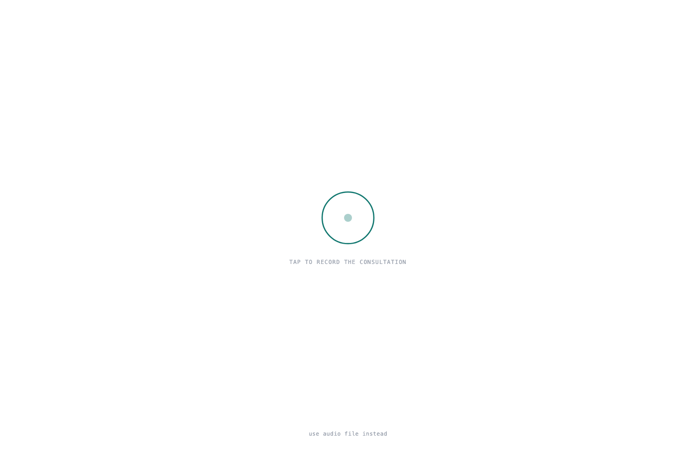
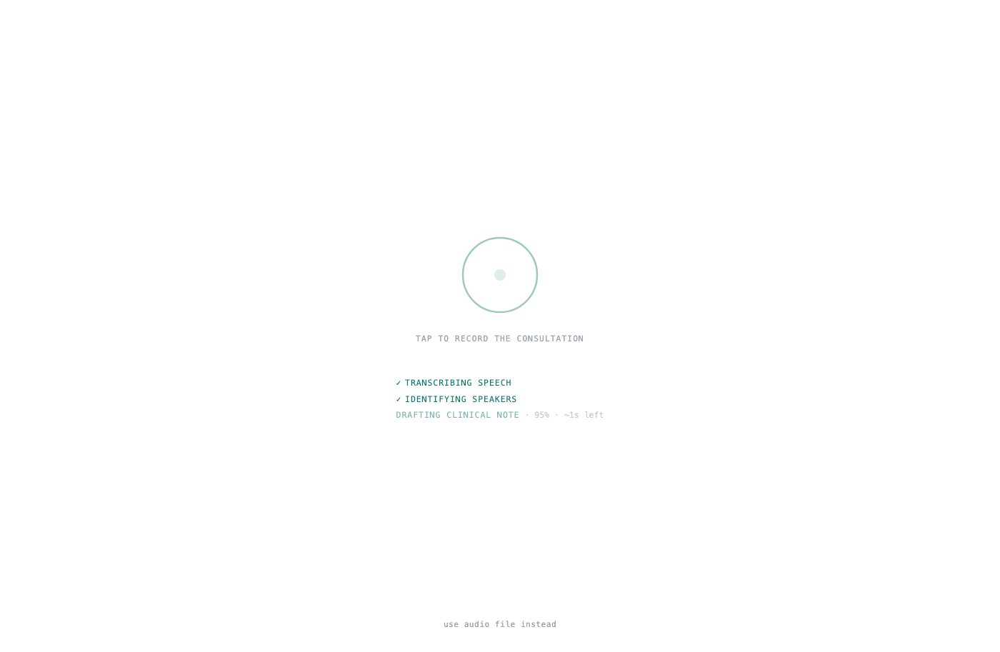
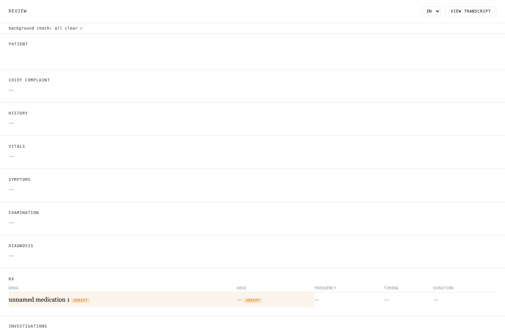
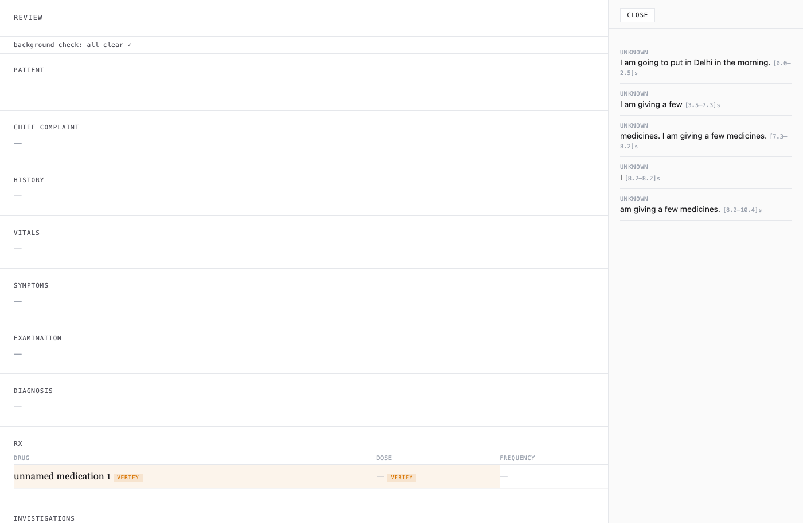
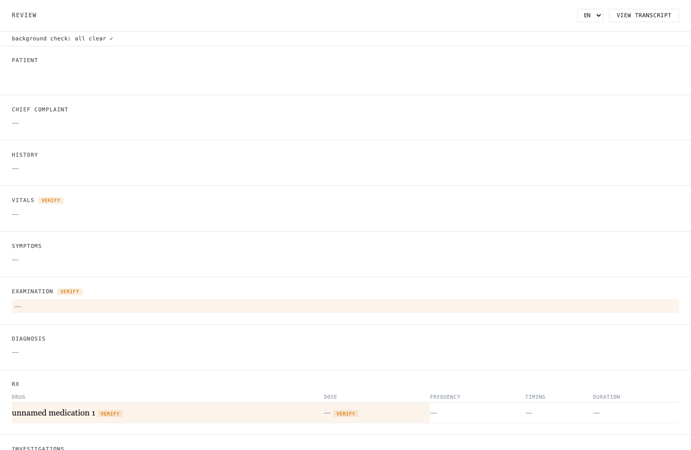

# CliniScribe

On-device clinical scribe for Indian tier-2/tier-3 clinics. It turns a recorded
consultation — Hindi, English, and Marathi, code-switched mid-sentence — into a
structured clinical note and a prescription PDF for the physician to review and sign.

| 1 · Record | 2 · Live progress |
|---|---|
|  |  |

| 3 · Review the note | 4 · Trace every field to its source |
|---|---|
|  |  |

Tap the mic, talk normally (Hindi/English/Marathi mixed is fine), stop — a
structured note appears in about a minute with live progress the whole way.
Every field links back to the exact sentence and timestamp it came from; a
background "second listen" re-checks the safety-critical spans (drugs, doses,
vitals, diagnosis) within ~60–90 seconds and flags any disagreement; edit
inline, switch the display language, sign, and print the prescription.

Everything runs locally on a MacBook Air (M-series, 24 GB RAM). No cloud APIs are in
the production path: patient privacy, cost, and unreliable rural connectivity rule them
out.

## Pipeline

A sequential, end-of-consultation batch (not streaming):

```
audio → L1 preprocess → L2 diarize → L3 ASR → L3.5 normalize → L4 extract → L5 render → [PHYSICIAN REVIEW]
```

| Stage | Job | Component |
|---|---|---|
| L1 | Resample to 16 kHz mono, trim silence, optional denoise | librosa / soundfile / noisereduce |
| L2 | Diarization — "who spoke when" | pyannote speaker-diarization-community-1 |
| L3 | ASR — speech to text, in the source language | faster-whisper large-v3 |
| L3.5 | Normalize lay→clinical terms; fix drug spellings | parrotlet-e embeddings + curated tables |
| L4 | Extract structured `ClinicalNote` JSON | qwen2.5:3b-instruct (Ollama) |
| L5 | Render prescription PDF | reportlab |

**Design constraints that shape everything:** (1) *on-device, 24 GB* — models are loaded
one at a time and released before the next (`del model; gc.collect()`), which is why the
pipeline is batch; (2) *patient safety* — the metric that matters most is accuracy on
drug names, doses, and vitals, not overall transcription quality.

## Prerequisites

- macOS on Apple Silicon (validated target: MacBook Air M-series, 24 GB). Other
  platforms may work but are untested.
- Python 3.11+
- [Ollama](https://ollama.com) running locally, with the L4 model pulled:
  `ollama pull qwen2.5:3b-instruct`
- A HuggingFace token (for model and dataset downloads), placed in `.env` as
  `HF_TOKEN=...`

## Installation

```bash
git clone git@github.com:dhritimandas/cliniscribe.git
cd cliniscribe

python -m venv .venv
source .venv/bin/activate
pip install -r requirements.txt

cp .env.example .env   # then add your HF_TOKEN
ollama pull qwen2.5:3b-instruct
```

Verify the HuggingFace token:

```bash
python -c "from huggingface_hub import whoami; import json; print(json.dumps(whoami(), indent=2))"
```

## Usage

```bash
# Run the full pipeline on one recording → PDF in outputs/
python src/pipeline.py path/to/consultation.wav

# Run the KARMA evaluation on the frozen eval sets
python eval/run_eval.py

# Run the test suite
pytest tests/ -v
```

Datasets (EkaCare, open access on HuggingFace) are pulled into `data/` on first use;
both `data/` and `outputs/` are gitignored.

## Review frontend (offline web app) — step-by-step

A fully offline FastAPI + single-page app for the record → review → edit →
sign → PDF workflow (`docs/frontend_contracts.md` documents the API and data
contracts). Follow these steps exactly; each one matters.

**Step 0 — one-time setup.** Complete the Installation section above
(venv, `pip install -r requirements.txt`, `.env` with your `HF_TOKEN`,
`ollama pull qwen2.5:3b-instruct`). On Apple Silicon, make sure your
`ollama` is a native arm64 build (`file $(which ollama)` should say `arm64`
— an x86_64 build under Rosetta runs the extraction model ~15x slower).
The first-ever run also downloads the ASR and embedding models from
HuggingFace (~3 GB total) — allow time and disk for that once.

**Step 1 — start Ollama** (terminal 1, leave it running):

```bash
ollama serve
```

**Step 2 — start the app** (terminal 2):

```bash
cd cliniscribe
source .venv/bin/activate
uvicorn web.app:app --host 127.0.0.1 --port 8000
```

Wait for `Uvicorn running on http://127.0.0.1:8000`.

**Step 3 — open http://127.0.0.1:8000/ in a browser.** You should see a
dark screen with a circular mic button. If you instead see an amber
"DEMO DATA — no backend connected" banner, you opened the HTML file
directly from disk — that mode shows fake fixture data; use the URL.

**Step 4 — record or upload.**
- *Record*: tap the mic ring (allow microphone access). While you speak, a
  quiet live transcript preview appears below the timer (refreshes ~10 s;
  it is a capture check only — the final transcript is produced after you
  stop). Tap the ring again to stop, or simply stop talking: recording
  auto-stops after 28 s of silence, with a visible countdown any speech
  cancels.
- *Upload*: click "use audio file instead" at the bottom and pick a
  wav/mp3 (e.g. `data/sample_00.mp3` for a known-good demo).

**Step 5 — wait, informed.** Three stage lines light up as real pipeline
stages finish, and the transcription line shows live progress:
`TRANSCRIBING SPEECH · 38% · ~2 min left`. On a MacBook Air M-series,
expect roughly **5–10 minutes for a 30-second consultation** — the
accuracy-safe ASR model is the bottleneck (see LEARNINGS.md for why the
faster engines were measured and rejected).

**Step 6 — review.** Edit any field inline (every edit is logged to
`outputs/<session>/corrections.jsonl` as a structured diff). Click a
field's "source" tag to see the transcript sentence it came from; "View
transcript" opens the full speaker-attributed conversation in a drawer
(CLOSE button or Escape to exit). The language dropdown (en/hi/mr)
translates labels, note text, and the transcript — drug names and doses
are never machine-translated, and the original text is always one tap
away. Amber "VERIFY" tags mark fields the physician must confirm.

**Step 7 — sign.** Click SIGN, fill doctor name / registration no. /
clinic, submit, then download the PDF in any of the three languages.
All artifacts live in `outputs/<session-id>/`; reopen a finished session
any time at `http://127.0.0.1:8000/#session=<session-id>`.

Record in the browser (or upload a file), watch real per-stage progress with
time remaining on every stage, review the extracted note with per-field
provenance ("source" links into the speaker-attributed transcript), edit
inline (every edit is logged to `outputs/<session>/corrections.jsonl` as a
structured diff), switch the UI and note text between English/Hindi/Marathi
(drug names and doses are never machine-translated), then sign — or use
DRAFT PDF AND PRINT, which opens the print dialog over the review page.
A background "second listen" re-decodes the safety-critical audio spans with
a larger model within ~60–90s and flags disagreements
( shows the all-clear
state). Flagged fields carry a text "VERIFY" badge — uncertainty is never
conveyed by color alone.

## Repository structure

```
src/
  types.py           # Segment, Turn, ClinicalNote — shared dataclasses (stage contracts)
  l1_preprocess.py   # preprocess()  — audio cleanup
  l2_diarize.py      # diarize()     — speaker segmentation
  l3_asr.py          # transcribe()  — multilingual ASR
  l3_5_normalize.py  # normalize()   — lay→clinical + drug-name normalization
  l4_extract.py      # extract()     — structured note via LLM
  l5_render.py       # render()      — prescription PDF
  pipeline.py        # orchestrates all stages sequentially
  cdsco.py           # CDSCO drug-list validation
  concepts.py        # clinical concept table for L3.5
eval/
  metrics.py         # WER, Keyword WER, Drug-KW WER, DER
  run_eval.py        # KARMA evaluation on frozen sets
tests/               # mirrors src/
LEARNINGS.md         # engineering + research record (start here for depth)
```

## Documentation

[`LEARNINGS.md`](LEARNINGS.md) is the in-depth record: the methodology and transferable
principles, stage-by-stage engineering status, the full experiment log (E1–E9 with
numbers and root causes), and the product/schema decisions. Read it to understand *why*
the system is built the way it is and how every result was measured.

## Evaluation

Every model swap or prompt change is scored on a **frozen evaluation set** before it is
accepted (the KARMA framework: WER, Keyword WER, Drug-Keyword WER, DER, concept-match
accuracy). The guiding discipline — *measure before you tune*, and *suspect the ruler
before the model* — is documented in `LEARNINGS.md`, Part II.

## Status

Research MVP. Stages L1–L5 are implemented and evaluated on real EkaCare data; the
output is intended for physician review, not autonomous use.
